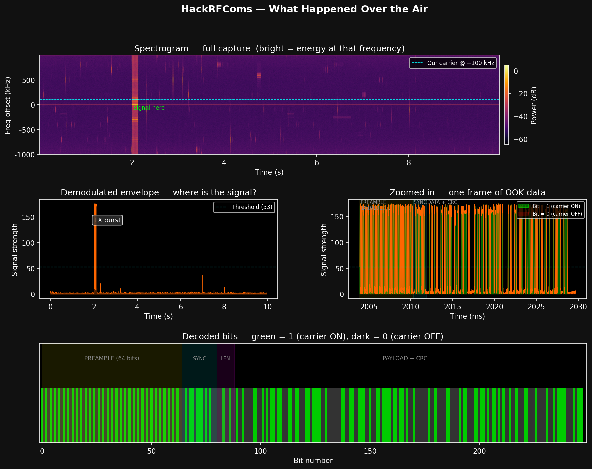
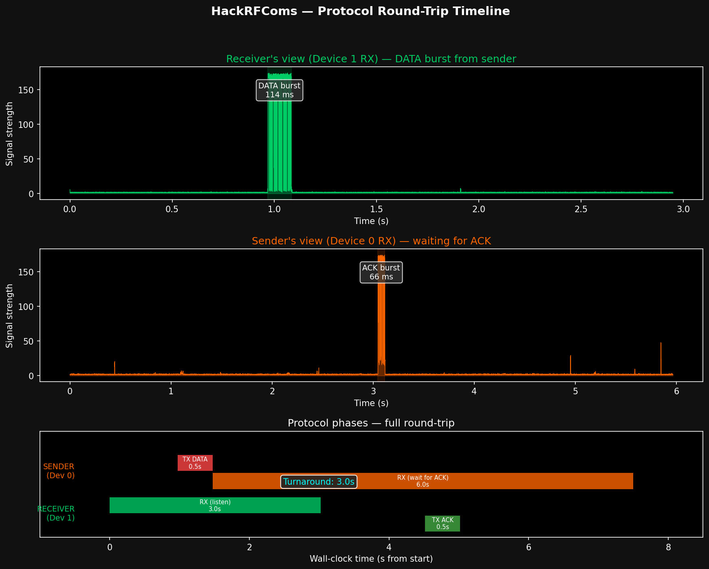
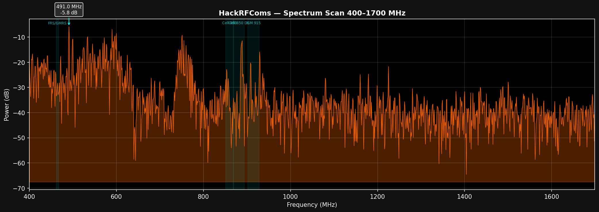

# HackRFComms

Multi-protocol RF platform built on HackRF One and Flipper Zero. OOK comms, ADS-B aircraft tracking, FM radio, AIS marine tracking, wideband spectrum scanning — all from scratch with raw IQ samples, numpy, and scipy. No GNURadio, no SDR frameworks.

## Signal Analysis

What a transmitted "Hello HackRF!" looks like through the demodulation chain:



Top to bottom: spectrogram showing the 100 kHz carrier burst, demodulated envelope with adaptive threshold, zoomed OOK symbols, and decoded bit stream (preamble → sync → length → payload → CRC).

## Protocol Round-Trip

Half-duplex DATA + ACK exchange between two devices:



Each device owns one HackRF. The sender transmits DATA, switches to RX, and waits for ACK. The receiver listens, decodes the DATA, waits for the sender's TX→RX switch (~65 ms), then sends ACK back.

**Optimization story:** Initial round-trip was 25 seconds. Tuned capture windows, TX duration floor, and switch delays down to **6.5 seconds**.

## Spectrum Scanner

400 MHz – 1.7 GHz swept in a single pass using `hackrf_sweep`:



TV broadcast around 491/600 MHz, cellular at 750–850 MHz, ISM at 915 MHz. The old per-step scanner took ~10 subprocess launches for 10 MHz — `hackrf_sweep` covers 1300 MHz in under a second.

## Three-Device RF Network

HackRFComs runs across two HackRF Ones and a Flipper Zero — three devices, two radio architectures (SDR + CC1101), same protocol:

```
HackRF 0 ←──── 915 MHz OOK ────→ HackRF 1
    ↕                                  ↕
    └──────── 915 MHz OOK ────→ Flipper Zero
              (.sub files)       ←─────┘
```

- **HackRF → HackRF**: OOK at 100 kHz carrier offset, ACK/NACK reliable transport
- **HackRF → Flipper**: Flipper captures raw .sub, decoded with `flipper_decode.py`
- **Flipper → HackRF**: .sub replay on Flipper, decoded by HackRF with auto carrier offset scan

Both directions verified over the air with CRC-validated message delivery.

## Protocol Modes

Unified launcher for all modes:

```bash
python3 hackrf.py adsb                      # ADS-B aircraft tracking (1090 MHz)
python3 hackrf.py adsb --duration 60        # Capture for 60 seconds
python3 hackrf.py scan 400 1700 --plot      # Spectrum scanner
python3 hackrf.py comms "Hello"             # Send message (OOK, 915 MHz)
python3 hackrf.py comms --rx                # Receive mode
python3 hackrf.py fm 93.9                   # FM radio demodulation
python3 hackrf.py ais --duration 30         # AIS marine vessel tracking
python3 hackrf.py flipper encode "Hello"    # Generate Flipper .sub file
python3 hackrf.py flipper decode cap.sub    # Decode Flipper .sub capture
python3 hackrf.py demo "test message"       # Original hello world demo
```

| Protocol | Frequency | Status |
|----------|-----------|--------|
| `comms` | 915 MHz | Working — OOK with ACK/NACK, HackRF ↔ Flipper cross-platform |
| `adsb` | 1090 MHz | Working — Mode S decoder with callsign, altitude, position, velocity |
| `fm` | 88–108 MHz | Working — wideband FM demod to WAV (de-emphasis, 44.1 kHz output) |
| `scan` | 1 MHz–6 GHz | Working — wideband spectrum scanner via `hackrf_sweep` |
| `flipper` | 915 MHz | Working — .sub encode/decode for Flipper Zero integration |
| `ais` | 162 MHz | Implemented — pending antenna validation (~46 cm needed) |
| `acars` | 131.55 MHz | Planned |
| `noaa` | 137 MHz | Planned |

Use `--device 0` or `--device 1` to select which HackRF to use.

## Flipper Zero Integration

The Flipper Zero's CC1101 radio speaks OOK at 915 MHz — the same modulation and frequency as HackRFComs. The `.sub` file format maps directly to our protocol: positive duration = carrier on, negative = carrier off, at 100 µs per symbol.

```bash
# Generate a .sub file, copy to Flipper SD at /ext/subghz/
python3 hackrf.py flipper encode "Hello from Flipper!"

# Decode a Flipper raw capture
python3 hackrf.py flipper decode captured_signal.sub

# Full workflow helper
python3 tools/flipper_bridge.py encode "Hello"
python3 tools/flipper_bridge.py decode captured.sub
python3 tools/flipper_bridge.py tx "Hello"    # TX from HackRF, capture on Flipper
```

The demodulator auto-scans carrier offsets (0–200 kHz) so it decodes both HackRF transmissions (100 kHz offset) and Flipper CC1101 transmissions (~35 kHz offset) without manual tuning.

## ADS-B Aircraft Tracking

Live Mode S decoder at 1090 MHz. Tested near Fort Lauderdale — 8 aircraft, 88 CRC-valid messages in 10 seconds:

```
[ADS-B] ICAO:AA40F5  Callsign:N76UD  Alt:850ft  Lat:26.2095  Lon:-80.1669
[ADS-B] ICAO:44D2AB  Alt:35975ft  Lat:26.2594  Lon:-80.2510  Speed:433kt  Heading:338
[ADS-B] ICAO:A255DA  Alt:34375ft  Lat:26.4131  Lon:-80.7476  Speed:393kt  Heading:298
```

Decodes callsigns (Type 1–4), airborne position with CPR lat/lon (Type 9–18), and velocity (Type 19). Uses 8 MS/s with vectorized half-bit downsampling for fast processing.

## FM Radio

Wideband FM demodulation to WAV:

```bash
python3 hackrf.py scan 88 108           # Find strongest station
python3 hackrf.py fm 93.9 --duration 10 # Demodulate to WAV
aplay iq_dumps/fm_93.9MHz.wav           # Play it
```

Conjugate-multiply discriminator → 15 kHz lowpass → 75 µs de-emphasis → resample to 44100 Hz → 16-bit WAV.

## Quick Start

```bash
# Prerequisites
pip install numpy scipy matplotlib
# hackrf tools must be installed (hackrf_transfer, hackrf_sweep)

# Edit config.py with your device serials
# (find them with: hackrf_info)

# Send a message between two HackRFs
python3 demo.py "Hello from HackRF!"

# Reliable send with ACK (two terminals)
python3 protocol.py rx                    # Terminal 1: receiver
python3 protocol.py send "Hello with ACK" # Terminal 2: sender

# Scan the spectrum
python3 scanner.py 88 108                 # FM radio band
python3 scanner.py 400 1700 --plot        # Wide sweep with plot
python3 scanner.py 900 930 --fine         # ISM band, 100 kHz resolution

# Visualize captured signals
python3 visualize.py                      # Spectrogram + demod analysis
python3 visualize_protocol.py             # Protocol timeline
```

## How the Modulation Works

```
Transmitter                              Receiver
──────────                               ────────
payload                                  IQ samples (int8)
  ↓ CRC-16                                ↓ complex signal
  ↓ frame (preamble+sync+len+data+crc)    ↓ mix down (100 kHz or auto-scan)
  ↓ OOK: bit=1 → carrier, bit=0 → silence ↓ lowpass filter (30 kHz, 4th order Butterworth)
  ↓ carrier at +100 kHz offset             ↓ envelope = |filtered|
  ↓ IQ samples (int8, amplitude 120)       ↓ adaptive threshold
  ↓ hackrf_transfer -t                     ↓ symbol sampling (phase search)
  ~~~~~~~~~~~~ 915 MHz ~~~~~~~~~~~~~→      ↓ sync word detection
                                           ↓ CRC verify
                                           payload
```

## Project Structure

| File | Purpose |
|------|---------|
| `hackrf.py` | Multi-protocol CLI launcher |
| `config.py` | Device serials, frequency, sample rate, gain, framing constants |
| `modulation.py` | OOK modulation/demodulation, frame building, CRC-16 |
| `demo.py` | Simple TX→RX hello world (two devices, threaded) |
| `protocol.py` | Reliable transport — DATA/ACK/NACK with retransmission |
| `scanner.py` | Wideband spectrum scanner using `hackrf_sweep` |
| `visualize.py` | 4-panel signal analysis (spectrogram, envelope, OOK, bits) |
| `visualize_protocol.py` | Protocol round-trip timeline visualization |
| `streaming.py` | Experimental streaming demodulator (WIP) |
| `protocols/adsb.py` | ADS-B Mode S decoder (1090 MHz) |
| `protocols/fm.py` | FM radio demodulator (88–108 MHz) |
| `protocols/ais.py` | AIS marine vessel tracker (162 MHz) |
| `protocols/acars.py` | ACARS aircraft messages (stub) |
| `protocols/noaa.py` | NOAA weather satellite (stub) |
| `tools/flipper_encode.py` | Generate Flipper .sub files from messages |
| `tools/flipper_decode.py` | Decode Flipper .sub captures |
| `tools/flipper_bridge.py` | Flipper workflow convenience wrapper |

## Hardware

- 2x HackRF One (r9) in PortaPack enclosures
- 1x Flipper Zero with CC1101 sub-GHz radio
- Firmware: 2026.01.3 (Device 0), v1.9.1 (Device 1)
- Stock telescopic antennas, ~1 meter apart on desk

## Notes

- `hackrf_transfer -r -` (stdout pipe) does not stream — only outputs headers. File-based capture is required.
- `pyhackrf2` only reliably opens device index 0. Device 1 gets `HACKRF_ERROR_LIBUSB`. The library also segfaults on `close()`.
- Device 0's RX was dead out of the box — fixed by reflashing CPLD with firmware v2026.01.3.
- TX→RX hardware switch time is ~65 ms. The protocol accounts for this.
- Flipper CC1101 transmits OOK at ~35 kHz offset from nominal frequency. The demodulator auto-scans to find it.
- AIS at 162 MHz requires a ~46 cm quarter-wave antenna. The stock telescopic (~20–25 cm) is too short.
